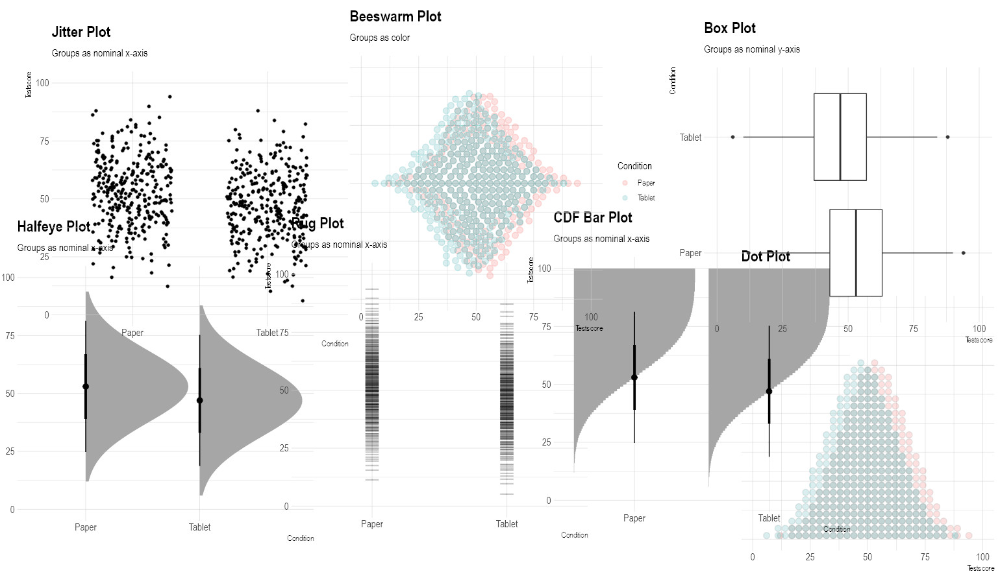

<style>
slides > slide:not(.nobackground):after {
  content: '';
}
</style>


```{r setup, include=FALSE}
knitr::opts_chunk$set(echo = FALSE,
                      message=FALSE, 
                      warning=FALSE)
# download.file("https://drive.google.com/uc?export=download&id=1NOgadyAeqmtqJ2mLI0GZHmOkavS5LLeW",
#               "www/references.bib", overwrite = T)
library(fontawesome)
```


## Background & Focus | Why designing science communication?

* Teachers are encouraged to consider evidence in their professional practice [@slavin.2020]<br /><br />
* teachers rarely draw on research evidence in their daily practice [e.g., @thommetal.2021]<br /><br />
* different strategies exist to increase / foster teachers’ engagement with evidence [@shavelson.2020]<br /><br />
* current approaches: toward a more intuitive science communication<br /> [@hedges.2018; @farley-rippleetal.2020]


## Background & Focus | Why looking at effect sizes?

* There exist several "clearing house" approaches<br />`r fa(name = "arrow-right")` “best available [...] evidence from systematic research” [@sackettetal.1996, p. 71]<br /><br />
* particularly evaluated according to the extent to which it allows to assess treatment effectiveness, i.e. the investigation of whether a treatment works [@apa.2002]<br /><br />
* Meta-analyses (research syntheses) = highest level of evidence<br />`r fa(name = "arrow-right")` ES = key information to be communicated [@burnsetal.2011]

## Background & Focus | Why looking at visualizations?

* scientists & clearing houses typically use standardized __textual__ representations [@cohen.1988]<br /><br />
* textual representations of effect sizes are __challenging__ for teachers' perception and understanding [@haneletal.2019; @lortie-forguesetal.2021]<br /><br />
* Alternative: visualizations [@franconerietal.2021]


## Background & Focus | Design, perception & use of visualizing ES


[@brownetal.2017]


## Background & Focus | Design, perception & use of visualizing ES


[@korbachetal.2017; @mcphetresetal.2020]

## Background & Focus | Design, perception & use of visualizing ES


[@lortie-forguesetal.2021]


## Background & Focus | What we know about visualizing data (in general)

<div class="franconeri"></div>


## Background & Focus | What we know about visualizing data (for lay people)

accurate estimation of statistical information needed for the evaluation of effect sizes: Type of visualization plays a role

* box plots: `r fa(name = "thumbs-up")` spread; `r fa(name = "thumbs-down")` distribution
* bar/line plot: `r fa(name = "thumbs-up")` mean
* modified stock chart: `r fa(name = "thumbs-up")` maxima, minima; `r fa(name = "thumbs-down")` spread

[@albersetal.2014; @pierceetal.2013]


## Objectives & Reserach Questions | Exploratory & descriptive: Visualization types


1. Does __visualization type__ affect A, B, C in assessing effect sizes?  
2. Which visualization types produce the __highest ratings__ in A, B, C?  

## Objectives & Reserach Questions | Exploratory & descriptive: Enrichment options


1. Does __visualization type__ affect A, B, C in assessing effect sizes?  
2. Which visualization types produce the __highest ratings__ in A, B, C?  
3. How do visualizations with __visual benchmarks__ affect A, B, C, compared to visualizations without benchmarks?  
4. How do visualizations with __textual cues__ affect A, B, C compared to visualizations without textual cues and a control group?


# Methods

## Pilot Study


**Delphi Study**   
  
* **4 Experts** in Data Visualization, **4 Experts** in Science Communication
* Phase 1: Collecting **16 visualization types** <br />(for group scores on a metric variable)

{width=70%}  


## Pilot Study

**Delphi Study**   
  
* **4 Experts** in Data Visualization, **4 Experts** in Science Communication
* Phase 1: Collecting **16 visualization types** <br />(for group scores on a metric variable)
* Phase 2: Rating and Ranking of **44 visualizations**


_"How accurately might teachers assess the effect size depicted in the plot above?"_  
(7-stufige Likert Skala; totally random - totally accurate)


## Pilot Study

**Delphi Study**   
  
* **4 Experts** in Data Visualization, **4 Experts** in Science Communication
* Phase 1: Collecting **16 visualization types** <br />(for group scores on a metric variable)
* Phase 2: Rating and Ranking of **44 Visualizations**


_"How accurately might teachers assess the effect size depicted in the plot above?"_  
(7-stufige Likert Skala; totally random - totally accurate)

__Results: Top ranked types__

{width=75%}  


## Study 1 | Visualization types: Design

* student teachers (N = Bayesian updating)
* 4 x 6 within-design
  - 4 visualization types
  - 6 effect sizes
* randomizations
  - order of conditions
  - vignettes (1 of 4 randomized between)


## Study 1 | Visualization types: Measures


* Perceived task difficulty [@marcusetal.1996]<br /><br />
* Sensitivity <span class="cite">(Merk et al., under review)</span>
* Accuracy
* Efficiency<br /><br />
* Perceived informativeness [@lortie-forguesetal.2021;<br />@haneletal.2019]
* Perceived value
* Intention to use

\

Demo: [es-vis-demo.formr.org](https://es-vis-demo.formr.org)


## Study 1 | Visualization types: Statistical Analyses

1. Does __visualization type__ affect A, B, C in assessing effect sizes?<br />`r fa(name = "arrow-right")`testing intraclass correlations  against 0<br /><br /><br />
2. Which visualization types produce the __highest ratings__?<br />`r fa(name = "arrow-right")`descriptive and graphical analyses


## Study 2 | Enrichment options: Design

* student teachers (N = Bayesian updating)
* 2 RCTs
  - Factor: visual benchmarking (yes vs. no)
  - Factor: textual cues (Vis+Text, VisOnly, TextOnly)
  
## Study 2 | Enrichment options: Design

* student teachers (N = Bayesian updating)
* 2 RCTs
  - Factor: visual benchmarking (yes vs. no)
  - Factor: textual cues (Vis+Text, VisOnly, TextOnly)

 

## Study 2 | Enrichment options: Design

* student teachers (N = Bayesian updating)
* 2 RCTs
  - Factor: visual benchmarking (yes vs. no)
  - Factor: textual cues (Vis+Text, VisOnly, TextOnly)

 

## Study 2 | Enrichment options: Design

* student teachers (N = Bayesian updating)
* 2 RCTs
  - Factor: visual benchmarking (yes vs. no)
  - Factor: textual cues (Vis+Text, VisOnly, TextOnly)
* randomizations
  - size of effect (d= -.8 to .8)
  - order of conditions
  - vignettes (1 of 4 randomized between)

## Study 2 | Visualization types: Measures

See Study 1

## Study 2 | Statistical Analyses

* approximate adjusted fractional Bayes factors [@hoijtinketal.2019a]

__Benchmarking__  
  
H3.1: $\mu(sens)_{noBench} < \mu(sens)_{Bench}$  
  
H3.2: $\mu(acc)_{noBench} < \mu(acc)_{Bench}$  
  
H3.3: $\mu(inf)_{noBench} < \mu(inf)_{Bench}$  
  
H3.4: $\mu(diff)_{noBench} > \mu(diff)_{Bench}$


## Study 2 | Statistical Analyses

* approximate adjusted fractional Bayes factors [@hoijtinketal.2019a]

__Textual Cues__  
  
H4.1: $(\mu(sens)_{VisOnly} , \mu(sens)_{TextOnly}) < \mu(sens)_{Vis+Text}$  
  
H4.2: $(\mu(acc)_{VisOnly} , \mu(acc)_{TextOnly}) < \mu(acc)_{Vis+Text}$  
  
H4.3: $(\mu(inf)_{VisOnly} , \mu(inf)_{TextOnly}) < \mu(inf)_{Vis+Text}$  
  
H4.4: $(\mu(diff)_{VisOnly} , \mu(diff)_{TextOnly}) > \mu(diff)_{Vis+Text}$


# Current progress

## Current progress

* Pilot study completed<br /><br />
* Abstract for Registered Report will be sumbitted tomorrow<br /><br />
* Next: Piloting of self-generated measures


# Vielen Dank

{width=20%}  
\

__Jürgen Schneider__  
juergen.schneider@uni-tuebingen.de  


# {-}


<div id="refs"></div>


# &nbsp;
__Icons:__  

<span style="font-size:.7em;">
Icons by Font Awesome CC BY 4.0
Title slide photo by <a href="https://unsplash.com/@rorymck94?utm_source=unsplash&utm_medium=referral&utm_content=creditCopyText">Rory McKeever</a> on <a href="https://unsplash.com/?utm_source=unsplash&utm_medium=referral&utm_content=creditCopyText">Unsplash</a>
  
</span>

## Cumulative Link Model

```{r, fig.height=2.8}
library(tidyverse)
scurve1 <- function(x){
    y <- exp(x) / (1 + exp(x))
    y <- y/verkleinerung
    return(y)
}

scurve2 <- function(x){
    y <- exp(-x) / (1 + exp(-x))
    y <- y/verkleinerung
    return(y)
}


mydnorm <- function(x){
    y <- dnorm(x, sd = 2)
    return(y)
}

p <- ggplot(data = data.frame(x = c(-3, 3)), aes(x))

verkleinerung <- 6

p + stat_function(fun = mydnorm, n = 100, geom = "area", alpha = .5, fill = "darkgrey") +
            stat_function(fun = scurve1, n = 100, geom = "area", alpha = .5, fill = "darkgreen") +
            stat_function(fun = scurve2, n = 100, geom = "area", alpha = .5, fill = "darkred") +
            scale_x_continuous(breaks = c(-3,-2,-1,0,1,2,3), 
                               labels = c(-.8, -.5, -.2, 0, .2, .5, .8), expand = c(0,0)) +
            xlab("Effektstärke [Cohen's d]") +
            ylab("Wahrscheinlichkeit") +
            theme_minimal()

verkleinerung <- 3

p + stat_function(fun = mydnorm, n = 100, geom = "area", alpha = .5, fill = "darkgrey") +
            stat_function(fun = scurve1, n = 100, geom = "area", alpha = .5, fill = "darkgreen") +
            stat_function(fun = scurve2, n = 100, geom = "area", alpha = .5, fill = "darkred") +
            scale_x_continuous(breaks = c(-3,-2,-1,0,1,2,3), 
                               labels = c(-.8, -.5, -.2, 0, .2, .5, .8), expand = c(0,0)) +
            xlab("Effektstärke [Cohen's d]") +
            ylab("Wahrscheinlichkeit") +
            theme_minimal()
```

