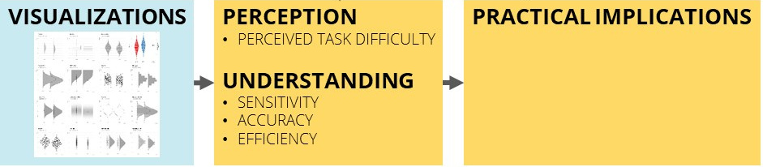

<div class="notes">

* university of education Karlsruhe
* get a first shot at the question: ...

</div>

<style>
slides > slide:not(.nobackground):after {
  content: '';
}
</style>


```{r setup, include=FALSE}
knitr::opts_chunk$set(echo = FALSE,
                      message=FALSE, 
                      warning=FALSE)

### SWITCH ON PRESENTER MODE
# ?presentme=true


### DOWNLOAD NEWEST SOURCES
# download.file("https://drive.google.com/uc?export=download&id=1NOgadyAeqmtqJ2mLI0GZHmOkavS5LLeW",
#               "www/references.bib", overwrite = T)


library(fontawesome)
library(kableExtra)
```


## Background & Focus | Why looking at ES visualizations?

<div class="box-bg-r">
   
   
 [educationendowmentfoundation.org.uk](https://educationendowmentfoundation.org.uk)
</div>

<div class="box60l">

* evidence-informed practice: knowing __"what works"__ is a key information[@sackettetal.1996; @apa.2002]<br /><br /><br />
* scientists & "clearing houses" typically use standardized __textual__ representations [@cohen.1988]<br /><br /><br />
* these are __challenging__ for teachers' sense-making [@haneletal.2019; @lortie-forguesetal.2021]<br /><br /><br />
* __Translations__ of ES (e.g. months of learning) often carry __undesired characteristics__ [@bairdetal.2019]<br /><br /><br />
* Alternative: visualizations [@franconerietal.2021]

</div>

<div style="position: absolute; top: 0%; right: 0%; background-color:#d4d4d4; font-size: .7em; padding: 5px">
__Slides__: [bit.ly/sig67-v (view)](https://bit.ly/sig67-v) | [bit.ly/sig67-d (download)](https://bit.ly/sig67-d)
</div>

<div class="notes">
* from an evidence-informed practice approach, treatment effectiveness is a key information
* How do we normally communicate ES? As scientists & some clearing houses  use __standardized__ and __textual__ representations
* there is __compelling evidence__ that __textual__ representations of __standardized__ ES are __challenging__ for teachers' perception and understanding
* Some clearing houses use __Translations__ of ES (e.g. months of learning) often carry __undesired characteristics__
* Alternative: visualizations
</div>


## Background & Focus | What we know about visualizing data (for lay people)

__accurately__ estimating statistical information: __plot type__ plays a role

* box plots: `r fa(name = "thumbs-up")` spread; `r fa(name = "thumbs-down")` distribution
* bar/line plot: `r fa(name = "thumbs-up")` mean
* modified stock chart: `r fa(name = "thumbs-up")` maxima, minima; `r fa(name = "thumbs-down")` spread [@albersetal.2014; @pierceetal.2013]

<div class="notes">
* there is a lot of basic research on visualizing statistical information
* however, when plotting ES a lot of these phenomena we know about on a __small scale__ come together and interact
* there is __first evidence__ that the __type of__ visualization we choose 
* plays a role as to how __accurately__ lay people estimate statistical information

</div>


## Background & Focus | What we know about visualizing data (for lay people)

__accurately__ estimating statistical information: __plot type__ plays a role

* box plots: `r fa(name = "thumbs-up")` spread; `r fa(name = "thumbs-down")` distribution
* bar/line plot: `r fa(name = "thumbs-up")` mean
* modified stock chart: `r fa(name = "thumbs-up")` maxima, minima; `r fa(name = "thumbs-down")` spread [@albersetal.2014; @pierceetal.2013]

\
\

__supporting the process__: __enrichment options__

* benchmarks (anchoring) [@cohen.1988; @jacowitzetal.1995]
* cues (signaling) [@schneideretal.2018]

<div class="notes">
* Enrichment options for these visualizations may further support the complex processes of sense-making
* A common approach is to provide __standardized benchmarks__ against which also researchers typically anchor their interpretations
* research on multimedia learning suggests that the use of __cues__ (e.g. arrows, labels) can direct observers' attention.
* This so-called signaling effect can increase understanding and reduce cognitive load
</div>

## Background & Focus | Perception, Understanding, Practical Implications


<div class="notes">
* I was talking a lot about "sense-making" so far, but what do we mean by that?  
* We are looking at __three aspects__ that we found to be relevant for processing visualizations...
</div>

## Background & Focus | Perception, Understanding, Practical Implications



[@korbachetal.2017; @mcphetresetal.2020]

<div class="notes">
Drawing on current research from __ES communication__ and __visualization__, we address:

* ... which is a cognitive load measure
* ... which reflects at what point the effect size between two groups in a plot are perceived as __difference__
* ... are participants accurately estimating the size of the effect?
* ... how quickly are they able to do it?

</div>

## Background & Focus | Perception, Understanding, Practical Implications


[@lortie-forguesetal.2021]

<div class="notes">

concerning practical implications we look at

* how informative and valuable the visualized information is for teaching practice
* how high are the chances are participants will use the information in their practice

</div>


## Objectives & Research Questions | &nbsp;


\
\
\

<span style="background-color:#f5f5f5; text-align:center; font-size:1.4em; margin-left:20%; padding:7px;">Which __plot types__ support sense-making?</span>
\
\

<span style="background-color:#d4d4d4; text-align:center; font-size:1.4em; margin-left:14%; padding:7px;">Which __enrichment options__ support sense-making?</span>


<div class="notes">
So in our project we want to contribute __first evidence__ toward the questions:

</div>


# Methods

## Pilot Study


**Delphi Study**   
  
* **4 Experts** in Data Visualization, **4 Experts** in Science Communication
* Phase 1: Collecting **16 plot types** <br />(for group scores on a metric variable)

{width=70%}  

<div class="notes">
* now if we want to find out what are __promising plot types__ to communicate ES<br />`r fa(name = "arrow-right")`we face the challenge that there is a universe of potential plot types to investigate
* so in a __pilot study__ we consulted experts in Data Visualization and Science Communication to help us collect and rank
* "plot types that they gauge suitable for depicting effect sizes to teachers"
* synthesizing these lists, resulted in 16 suitable plot types
</div>


## Pilot Study

**Delphi Study**   
  
* **4 Experts** in Data Visualization, **4 Experts** in Science Communication
* Phase 1: Collecting **16 plot types** <br />(for group scores on a metric variable)
* Phase 2: Rating and Ranking of **44 plots**


_"How accurately might teachers assess the ES depicted in the plot above?"_  
(7-point Likert Skala; totally random - totally accurate)

<div class="notes">
* for each plot type we created a plot distinguishing the groups on the y-axis; x-axis and by color
* we then asked them to rate and rank these plots as to ...
</div>

## Pilot Study

**Delphi Study**   
  
* **4 Experts** in Data Visualization, **4 Experts** in Science Communication
* Phase 1: Collecting **16 plot types** <br />(for group scores on a metric variable)
* Phase 2: Rating and Ranking of **44 plots**


_"How accurately might teachers assess the ES depicted in the plot above?"_  
(7-point Likert Skala; totally random - totally accurate)
\
\

__Results: Top ranked types__

{width=75%}  

<div class="notes">
* the top 4 ranked plots are...
* the rankings of both expert groups are __surprisingly similar__: top 4 plots in both groups
* and with these 4 plots we will investigate the RQ mentioned before
</div>


## Study 1 | plot types: Design

<span style="background-color:#f5f5f5;">Does __plot type__ affect the outcomes in assessing ES?</span>  
  
<span style="background-color:#f5f5f5;">Which plot types produce the __most desirable scores__ in the outcomes?</span>

\

* in-service __teachers__ (N = Bayesian updating)<br /><br />
* __4 x 6__ within-design
  - 4 plot types
  - 6 ES (_d_= -.8 to .8)<br /><br />
* __randomizations__
  - order of conditions
  - vignettes (1 of 4 randomized between)

<div class="notes">
* as a reminder the first part of the RQ were: ...
* we will try to answer these questions with __in-service__ teachers
* who will evaluate all 4 plots depicting 6 different effect sizes from ...
</div>


## Study 1 | plot types: Measures

```{r}
options("kableExtra.html.bsTable" = T)

measures <- data.frame(construct = c(
                         "Perceived task difficulty",
                         "Sensitivity",
                         "Accuracy",
                         "Efficiency",
                         "Perceived informativeness",
                         "Perceived value",
                         "Intention to use"),
                       example_item = c(
                         "How difficult was it for you to understand the figure?",
                         "Is one group superior to the other or are they approximately the same?",
                         "How much percent of the groups will overlap on the test score?",
                         "[time taken to answer sensitivity and accuracy]",
                         "How informative do you perceive the way the information is presented in the figure?",
                         "To what extent are these results relevant for your future teaching?",
                         "How likely is it that you will consider consequences based on the results in your future teaching?"
                       ),
                       source = c(
                         "(Marcus et al., 1996)",
                         "(Merk et al., under review)",
                         "own creation",
                         "own creation",
                         "(Lortie-Forgues et al., 2021)
",
                         "own creation",
                         "own creation"
                       ))

measures %>%
  kbl() %>%
  kable_styling(font_size = 24) %>%
  row_spec(1, background = "#efefef") %>%
  row_spec(5:7, background = "#efefef")
```


\

Demo: [es-vis-demo.formr.org](https://es-vis-demo.formr.org)

<div class="notes">
* I can't go into too much detail with the operationalizations of the 7 constructs
* but I can give you a glimpse of the survey structure
</div>

## Study 2 | Enrichment options: Design

<span style="background-color:#d4d4d4;">How do plots with __visual benchmarks__ affect the outcomes, compared to plots without benchmarks?</span>  
  
<span style="background-color:#d4d4d4;">How do plots with __cues__ affect the outcomes compared to plots without cues?</span>

\

* in-service __teachers__ (N = Bayesian updating)<br /><br />
* __2 RCTs__
  - Factor: visual benchmarking (yes vs. no)
  - Factor: cues (difference, overlap, no cue)
  
<div class="notes">
* In study 2 we investigate the enrichment options: ...
* we will investigate these questions in 2 RCTs
* comparing visual benchmarking to no benchmarking
* and cues about difference, to cues about overlap, to no cues
</div>
  


# Current progress

## Current progress | and further plans

<div class="box60l">
<br /><br />

* __Pilot study__ completed<br /><br /><br />
* __Piloting__ of self-generated __measures__<br /><br /><br />
* writing stage 1 Registered Report<br /><br /><br />
* planned: conceptual replication with __student teachers__

</div>

<div class="box-bg-r" style="padding-top:230px;">
 `r fa(name = "forward", fill="white", width = "230px")`
</div>

<div class="notes">
so how far did we get?

* we completed the pilot study with the experts
* currently we are piloting the self-generated measures on sensitivity, accuracy, and practical implications
* writing stage 1 Registered Report
* future plans are a conceptual replication of this study with student teachers
</div>


# Thank you

{width=20%}  
\

__Jürgen Schneider__  
juergen.schneider@uni-tuebingen.de  
  
\

<div style="position: absolute; bottom: 2%; left: 10%;">
__Slides__: [bit.ly/sig67-v (view)](https://bit.ly/sig67-v) | [bit.ly/sig67-d (download)](https://bit.ly/sig67-d)
</div>


# {-}


<div id="refs"></div>


# &nbsp;
__Icons:__  

<span style="font-size:.7em;">
Icons by Font Awesome CC BY 4.0
  
</span>

## Background & Focus | Why looking at effect sizes?


<div class="box-bg-r">
{width=95%}
</div>

<div class="box60l">

* "__clearing house__" approaches<br />`r fa(name = "arrow-right")` “best available [...] evidence from systematic research” [@sackettetal.1996, p. 71]<br /><br /><br /><br />
* evaluated according to the extent to which it allows to assess __treatment effectiveness__ [@apa.2002]<br /><br /><br /><br />
* Meta-analyses demonstrate highest level of evidence<br />`r fa(name = "arrow-right")` ES = __key information__ to be communicated [@burnsetal.2011]

</div>


<div class="notes">
* from an evidence-informed practice perspective
* so called "__clearing house__" approaches<br />`r fa(name = "arrow-right")` try to make the “best available [...] evidence from systematic research” __accessible__ to ...
* particularly evaluated according to the extent to which it allows to assess __treatment effectiveness__, i.e. the investigation of whether a treatment works<br />`r fa(name = "arrow-right")` so in our study we look at group differences
* Meta-analyses = highest level of evidence<br />`r fa(name = "arrow-right")` ES = key information to be communicated
</div>


## Background & Focus | Why designing science communication?

<div class="box-bg-r">
 <span style="font-size: 3em; line-height: .9em;">
 <br /><br />
 evidence  
 informed  
 practice
 </span>
</div>

<div class="box60l">

* Teachers: encouraged to consider __evidence__ from research [@slavin.2020]<br /><br /><br /><br />
* in their daily practice, they __rarely__ draw on research evidence  [e.g., @thommetal.2021]<br /><br /><br /><br />
* current approaches: toward __intuitive__ science communication<br /> [@hedges.2018; @farley-rippleetal.2020]

</div>

<div class="notes">
* Teachers are encouraged to consider evidence in their professional practice
* teachers rarely draw on research evidence in their daily practice
* different strategies exist to increase / foster teachers’ engagement with evidence
* current approaches: toward a more intuitive science communication
</div>


## Background & Focus | What we know about visualizing data (in general)

<div class="franconeri"></div>

<div class="notes">

* there is quite some basic research on visualizing information
* for example using position (dot plot) it is easier estimating the mean than using areas
* these results give us first ideas of what to expect
* however, when plotting ES, several of these phenomena come together: most plots use position AND length AND area

</div>


## Objectives & Research Questions | Exploratory & descriptive: plot types


1. <span style="background-color:#f5f5f5;">Does __plot type__ affect the outcomes in assessing ES?</span>  
2. <span style="background-color:#f5f5f5;">Which plot types produce the __most desirable scores__ in the outcomes?</span> 


<div class="notes">
</div>


## Objectives & Research Questions | Confirmatory: Enrichment options


1. <span style="background-color:#f5f5f5;">Does __plot type__ affect the outcomes in assessing ES?</span>  
2. <span style="background-color:#f5f5f5;">Which plot types produce the __most desirable scores__ in the outcomes?</span>
3. <span style="background-color:#d4d4d4;">How do plots with __visual benchmarks__ affect the outcomes, compared to plots without benchmarks?</span>  
4. <span style="background-color:#d4d4d4;">How do plots with __cues__ affect the outcomes compared to plots without cues?</span>


## Cumulative Link Model

```{r, fig.height=2.8}
library(tidyverse)
scurve1 <- function(x){
    y <- exp(x) / (1 + exp(x))
    y <- y/verkleinerung
    return(y)
}

scurve2 <- function(x){
    y <- exp(-x) / (1 + exp(-x))
    y <- y/verkleinerung
    return(y)
}


mydnorm <- function(x){
    y <- dnorm(x, sd = 2)
    return(y)
}

p <- ggplot(data = data.frame(x = c(-3, 3)), aes(x))

verkleinerung <- 6

p + stat_function(fun = mydnorm, n = 100, geom = "area", alpha = .5, fill = "darkgrey") +
            stat_function(fun = scurve1, n = 100, geom = "area", alpha = .5, fill = "darkgreen") +
            stat_function(fun = scurve2, n = 100, geom = "area", alpha = .5, fill = "darkred") +
            scale_x_continuous(breaks = c(-3,-2,-1,0,1,2,3), 
                               labels = c(-.8, -.5, -.2, 0, .2, .5, .8), expand = c(0,0)) +
            xlab("Effektstärke [Cohen's d]") +
            ylab("Wahrscheinlichkeit") +
            theme_minimal()

verkleinerung <- 3

p + stat_function(fun = mydnorm, n = 100, geom = "area", alpha = .5, fill = "darkgrey") +
            stat_function(fun = scurve1, n = 100, geom = "area", alpha = .5, fill = "darkgreen") +
            stat_function(fun = scurve2, n = 100, geom = "area", alpha = .5, fill = "darkred") +
            scale_x_continuous(breaks = c(-3,-2,-1,0,1,2,3), 
                               labels = c(-.8, -.5, -.2, 0, .2, .5, .8), expand = c(0,0)) +
            xlab("Effektstärke [Cohen's d]") +
            ylab("Wahrscheinlichkeit") +
            theme_minimal()
```


## Study 2 | Enrichment options: Design

<span style="background-color:#d4d4d4;">How do plots with __visual benchmarks__ affect the outcomes, compared to plots without benchmarks?</span>  
  
<span style="background-color:#d4d4d4;">How do plots with __cues__ affect the outcomes compared to plots without cues?</span>

\

* in-service __teachers__ (N = Bayesian updating)<br /><br />
* __2 RCTs__
  - Factor: visual benchmarking (yes vs. no)
  - Factor: cues (difference, overlap, no cue)

<div style="position:absolute; top: 3%; right:7%; height: 70%; width:30%"> 
</div>

<div class="notes">
* visual benchmarking CAN look like this (first draft of the condition)
* on the top we provide a benchmark of a certain effect size
* on the bottom we provide the ES to be evaluated
* so participants are able to draw comparisons to the benchmark
</div>

## Study 2 | Enrichment options: Design

<span style="background-color:#d4d4d4;">How do plots with __visual benchmarks__ affect the outcomes, compared to plots without benchmarks?</span>  
  
<span style="background-color:#d4d4d4;">How do plots with __cues__ affect the outcomes compared to plots without cues?</span>

\

* in-service __teachers__ (N = Bayesian updating)<br /><br />
* __2 RCTs__
  - Factor: visual benchmarking (yes vs. no)
  - Factor: cues (difference, overlap, no cue)

<div style="position:absolute; top: 40%; right:7%; width:37%">
</div>

<div class="notes">
* this is a first draft of a cue on difference
* labeling a mean and an area, describing the effect size Cohens U3
</div>

## Study 2 | Enrichment options: Design

<span style="background-color:#d4d4d4;">How do plots with __visual benchmarks__ affect the outcomes, compared to plots without benchmarks?</span>  
  
<span style="background-color:#d4d4d4;">How do plots with __cues__ affect the outcomes compared to plots without cues?</span>

\

* in-service __teachers__ (N = Bayesian updating)<br /><br />
* __2 RCTs__
  - Factor: visual benchmarking (yes vs. no)
  - Factor: cues (difference, overlap, no cue)<br /><br />
* __randomizations__
  - size of effect (d= -.8 to .8)
  - order of conditions
  - vignettes (1 of 4 randomized between)
  
<div class="notes">
* we again randomize the same variables
</div>

## Study 2 | plot types: Measures

same as Study 1

```{r}
measures %>%
  kbl() %>%
  kable_styling(font_size = 24) %>%
  row_spec(1, background = "#efefef") %>%
  row_spec(5:7, background = "#efefef")
```

<div class="notes">
* and observe the same measures
</div>

## Study 2 | Statistical Analyses

* approximate adjusted fractional Bayes factors [@hoijtinketal.2019a]

__Benchmarking__  
  
H3.1: $\mu(sens)_{noBench} < \mu(sens)_{Bench}$  
  
H3.2: $\mu(acc)_{noBench} < \mu(acc)_{Bench}$  
  
H3.3: $\mu(inf)_{noBench} < \mu(inf)_{Bench}$  
  
H3.4: $\mu(diff)_{noBench} > \mu(diff)_{Bench}$


## Study 2 | Statistical Analyses

* approximate adjusted fractional Bayes factors [@hoijtinketal.2019a]

__Textual Cues__  
  
H4.1: $(\mu(sens)_{VisOnly} , \mu(sens)_{TextOnly}) < \mu(sens)_{Vis+Text}$  
  
H4.2: $(\mu(acc)_{VisOnly} , \mu(acc)_{TextOnly}) < \mu(acc)_{Vis+Text}$  
  
H4.3: $(\mu(inf)_{VisOnly} , \mu(inf)_{TextOnly}) < \mu(inf)_{Vis+Text}$  
  
H4.4: $(\mu(diff)_{VisOnly} , \mu(diff)_{TextOnly}) > \mu(diff)_{Vis+Text}$
