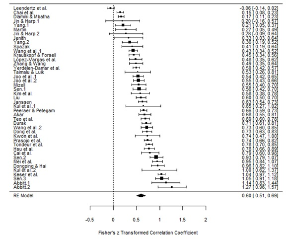

```{r setup, include=FALSE}
knitr::opts_chunk$set(echo = FALSE,
                      message=FALSE, 
                      warning=FALSE)

### SWITCH ON PRESENTER MODE
# ?presentme=true


### DOWNLOAD NEWEST SOURCES
# download.file("https://drive.google.com/uc?export=download&id=1ASV99YHMHSNChSNzqbZwvz2SiqYvmqO_", # befindet sich im DIPF Ordner
#               "www/references.bib", overwrite = T)


library(fontawesome)
library(kableExtra)
```


# Slides: [bit.ly/WB-06-12](https://bit.ly/WB-06-12)


## Background & Focus | Why designing science communication?

<div class="box-bg-r">
 <span style="font-size: 3em; line-height: .9em;">
 <br /><br />
 evidence  
 informed  
 practice
 </span>
</div>

<div class="box60l">

* Teachers: encouraged to consider __evidence__ from research [@slavin.2020]<br /><br /><br /><br />
* Barriers: in their daily practice, they __rarely__ draw on research evidence  [e.g., @thommetal.2021]<br /><br /><br /><br />
* current approaches: toward __teacher-friendly__ science communication<br /> [@hedges.2018; @farley-rippleetal.2020]

</div>

<div class="notes">
* Teachers are encouraged to consider evidence in their professional practice
* teachers rarely draw on research evidence in their daily practice
* different strategies exist to increase / foster teachers’ engagement with evidence
* current approaches: toward a more teacher-friendly science communication
</div>


## Background & Focus | Why looking at effect sizes?


<div class="box-bg-r">
{width=95%}
</div>

<div class="box60l">

* "__clearing house__" approaches<br />`r fa(name = "arrow-right")` “best available [...] evidence from systematic research” [@sackettetal.1996, p. 71]<br /><br /><br /><br />
* evaluated according to the extent to which it allows to assess __treatment effectiveness__ [@apa.2002]<br /><br /><br /><br />
* Meta-analyses demonstrate highest level of evidence<br />`r fa(name = "arrow-right")` ES = __key information__ to be communicated [@burnsetal.2011]

</div>


<div class="notes">
* from an evidence-informed practice perspective
* so called "__clearing house__" approaches<br />`r fa(name = "arrow-right")` try to provide teachers with the “best available [...] evidence from systematic research” __accessible__ to ...
* particularly evaluated according to the extent to which it allows to assess __treatment effectiveness__, i.e. the investigation of whether a treatment works<br />`r fa(name = "arrow-right")` so in our study we look at group differences
* Meta-analyses = highest level of evidence<br />`r fa(name = "arrow-right")` ES = key information to be communicated
</div>


## Background & Focus | Why looking at ES visualizations?

<div class="box-bg-r2">
   
 [clearinghouse.edu.tum.de](https://www.clearinghouse.edu.tum.de)  
   
   
   
 [educationendowmentfoundation.org.uk](https://educationendowmentfoundation.org.uk)
</div>

<div class="box60l">

* scientists & "clearing houses" typically use standardized __textual__ representations [@cohen.1988]<br /><br /><br />
* these are __challenging__ for teachers' sense-making [@haneletal.2019; @lortie-forguesetal.2021]<br /><br /><br />
* __Translations__ of ES (e.g. months of learning) often carry __undesired characteristics__ [@bairdpane.2019; @kimetal.2022; @lortie-forguesetal.2021]<br /><br /><br />
* Alternative: visualizations [@franconerietal.2021]

</div>


<div class="notes">
* How do we normally communicate ES? As scientists & some clearing houses  use __standardized__ and __textual__ representations
* there is __compelling evidence__ that __textual__ representations of __standardized__ ES are __challenging__ for teachers' perception and understanding
  + Cohen'S d / Percentile gain = rated as little informative
  + depending on which metric we present: perceived treatment effectiveness differ
* Some clearing houses use __Translations__ of ES (e.g. months of learning) often carry __undesired characteristics__
  + although they are often perceived as more informative (Lortie-forgues)
  + may produce little accuracy (Kim)
  + may produce misconceptions (Schmid et al.)
* Alternative: visualizations
</div>


## Background & Focus | teacher-friendly communication of ES

<div class = "container">

<div class="flowchart1"></div>

<div style="width:5%; padding-top:15%">`r fa(name = "arrow-right", width = "40px")`</div>

<div style="width:60%">
 <div class="flowchart2a">__COGNITIVE PROCESSING__<br /><br /><br /></div>

 <div class="flowchart2b">__UNDERSTANDING__<br /><br /><br /></div>
 
 <div class="flowchart2c">__PERCEPTIONS OF RELEVANCE FOR PRACTICE__<br /><br /><br /></div>
 </div>
 
</div>

[@jensengerber.2020]


<div class="notes">
* I was talking a lot about "teacher-friendly" so far, but what do we mean by that?  
* We are looking at __three aspects__ that we found to be relevant in the realm of science communication...
</div>

## Background & Focus | teacher-friendly communication of ES

<div class = "container">

<div class="flowchart1"></div>

<div style="width:5%; padding-top:15%">`r fa(name = "arrow-right", width = "40px")`</div>

<div style="width:60%">
 <div class="flowchart2a">__COGNITIVE PROCESSING__  
- task difficulty  
- efficiency</div>
 <div class="flowchart2b">__UNDERSTANDING__<br /><br /><br /></div>
  <div class="flowchart2c">__PERCEPTIONS OF RELEVANCE FOR PRACTICE__<br /><br /><br /></div>
 </div>
 
</div>

[@marcusetal.1996; @korbachetal.2017]

<div class="notes">
Drawing on current research from __ES communication__ and __visualization__, we address:

* ... which is a cognitive load measure
* ... how quickly are they able to do it?
* ... which reflects at what point the effect size between two groups in a plot are perceived as __difference__
* ... are participants accurately estimating the size of the effect?

</div>

## Background & Focus | teacher-friendly communication of ES

<div class = "container">

<div class="flowchart1"></div>

<div style="width:5%; padding-top:15%">`r fa(name = "arrow-right", width = "40px")`</div>

<div style="width:60%">
 <div class="flowchart2a">__COGNITIVE PROCESSING__  
- task difficulty  
- efficiency</div>
 <div class="flowchart2b">__UNDERSTANDING__  
- accuracy  
- sensitivity</div>
  <div class="flowchart2c">__PERCEPTIONS OF RELEVANCE FOR PRACTICE__<br /><br /><br /></div>
 </div>
</div>

<div class="cite myref">(Merk et al., in press)</div>
 
<div class="notes">

* ... are participants accurately estimating the size of the effect?
* ... which reflects at what point the effect size between two groups in a plot are perceived as __difference__

</div>

## Background & Focus | teacher-friendly communication of ES

<div class = "container">

<div class="flowchart1"></div>

<div style="width:5%; padding-top:15%">`r fa(name = "arrow-right", width = "40px")`</div>

<div style="width:60%">
 <div class="flowchart2a">__COGNITIVE PROCESSING__  
- task difficulty  
- efficiency</div>
 <div class="flowchart2b">__UNDERSTANDING__  
- accuracy  
- sensitivity</div>
  <div class="flowchart2c">__PERCEPTIONS OF RELEVANCE FOR PRACTICE__  
- perceived informativity  
- perceived value</div>
 </div>
 
</div>

[@lortie-forguesetal.2021]


<div class="notes">

concerning practical implications we look at

* how informative and valuable the visualized information is for teaching practice
* how high are the chances are participants will use the information in their practice

</div>


## Background & Focus | What we know about visualizing data (for lay people)

__accurately__ estimating statistical information: __plot type__ plays a role

* box plots: `r fa(name = "thumbs-up")` spread; `r fa(name = "thumbs-down")` distribution
* bar/line plot: `r fa(name = "thumbs-up")` mean
* modified stock chart: `r fa(name = "thumbs-up")` maxima, minima; `r fa(name = "thumbs-down")` spread [@albersetal.2014; @piercechick.2013]

<div class="notes">
* there is a lot of basic research on visualizing statistical information
* however, when plotting ES a lot of these phenomena we know about on a __small scale__ come together and interact
* there is __first evidence__ that the __type of__ visualization we choose 
* plays a role as to how __accurately__ lay people estimate statistical information

</div>


## Background & Focus | What we know about visualizing data (for lay people)

__accurately__ estimating statistical information: __plot type__ plays a role

* box plots: `r fa(name = "thumbs-up")` spread; `r fa(name = "thumbs-down")` distribution
* bar/line plot: `r fa(name = "thumbs-up")` mean
* modified stock chart: `r fa(name = "thumbs-up")` maxima, minima; `r fa(name = "thumbs-down")` spread [@albersetal.2014; @piercechick.2013]

\
\

__supporting the process__: __enrichment options__

* benchmarks (anchoring) [@cohen.1988; @jacowitzkahneman.1995]
* cues (signaling) [@schneideretal.2018]

<div class="notes">
* Enrichment options for these visualizations may further support the complex processes of sense-making
* A common approach is to provide __standardized benchmarks__ against which also researchers typically anchor their interpretations
* research on multimedia learning suggests that the use of __cues__ (e.g. arrows, labels) can direct observers' attention.
* This so-called signaling effect can increase understanding and reduce cognitive load
</div>


## Background & Focus | What we know about visualizing data (for lay people)

* Laypeople are __unimpressed__ by plotted ES [@mcphetrespennycook.2020]<br /><br /><br />
* adding means to plots increases perception of ES [@kaleetal.2020]

<div class="notes">
* for d=.9: ~55% would say "Group A definitively has higher scores than Group B"
  + they would call it something between "small" and "medium"
* in a sense that it increases bias
</div>


## Background & Focus | Research interests & Studies


<div class="container">
 <div class="box30">
  <div class="blueTop">__Delphi-Study__</div>
  <div class="blueBottom"><br />__Expert judgment__ on teacher-friendly plots<br /><br /><br />_exploratory_</div>
 </div>
 <div class="box30">
 <div class="blueTop">__Study 1__</div>
  <div class="blueBottom"><br />Compare __plot types__ for their teacher-friendlyness<br /><br />_exploratory_</div>
 </div>
 <div class="box30">
 <div class="blueTop">__Study 2__</div>
  <div class="blueBottom"><br />Compare __enrichment options__ for their teacher-friendlyness<br /><br />_confirmatory_</div>
 </div>

</div>


# Methods

## Delphi Study


  
* **4 Experts** in Data Visualization, **4 Experts** in Science Communication
* Phase 1: Collecting **16 plot types** <br />(for group scores on a metric variable)

{width=70%}  

<div class="notes">
* now if we want to find out what are __promising plot types__ to communicate ES<br />`r fa(name = "arrow-right")`we face the challenge that there is a universe of potential plot types to investigate
* so in a __pilot study__ we consulted experts in Data Visualization and Science Communication to help us collect and rank
* "plot types that they gauge suitable for depicting effect sizes to teachers"
* synthesizing these lists, resulted in 16 suitable plot types
</div>


## Delphi Study

  
* **4 Experts** in Data Visualization, **4 Experts** in Science Communication
* Phase 1: Collecting **16 plot types** <br />(for group scores on a metric variable)
* Phase 2: Rating and Ranking of **44 plots**


_"How accurately might teachers assess the ES depicted in the plot above?"_  
(7-point Likert scale; totally random - totally accurate)

<div class="notes">
* for each plot type we created a plot distinguishing the groups on the y-axis; x-axis and by color
* we then asked them to rate and rank these plots as to ...
</div>

## Delphi Study

  
* **4 Experts** in Data Visualization, **4 Experts** in Science Communication
* Phase 1: Collecting **16 plot types** <br />(for group scores on a metric variable)
* Phase 2: Rating and Ranking of **44 plots**


_"How accurately might teachers assess the ES depicted in the plot above?"_  
(7-point Likert scale; totally random - totally accurate)
\
\

__Results: Top ranked types__

{width=75%}  

<div class="notes">
* the top 4 ranked plots are...
* the rankings of both expert groups are __surprisingly similar__: top 4 plots in both groups
* and with these 4 plots we will investigate the RQ mentioned before
</div>


## Study 1 | plot types: Design

<span style="background-color:#f5f5f5;">Does __visualization type__ affect understanding, cognitive processing and perceptions of relevance?</span>  
  
<span style="background-color:#f5f5f5;">Which __visualization types__ produce the most desirable ratings?</span>

\

* in-service __teachers__ (N = 40)<br /><br />
* __4 x 6__ within-design
  - 4 plot types
  - 6 ES (_d_= -.8 to .8)<br /><br />
* __randomizations__
  - order of conditions
  - vignettes (1 of 4 randomized between)

<div class="notes">
* as a reminder the first part of the RQ were: ...
* we will try to answer these questions with __in-service__ teachers
* who will evaluate all 4 plots depicting 6 different effect sizes from ...
</div>


## Study 1 | plot types: Measures

```{r}
options("kableExtra.html.bsTable" = T)

measures <- data.frame(construct = c(
                         "Perceived task difficulty",
                         "Efficiency",
                         "Sensitivity",
                         "Accuracy",
                         "Perceived informativity",
                         "Perceived value"),
                       example_item = c(
                         "How difficult was it for you to understand the figure?",
                         "[time taken to answer sensitivity and accuracy]",
                         "Is one group superior to the other or are they approximately the same?",
                         "How much percent of the groups will overlap on the test score?",
                         "How informative do you perceive the way the information is presented in the figure?",
                         "To what extent are these results relevant for your future teaching?"
                       ),
                       source = c(
                         "(Marcus et al., 1996)",
                         "own creation",
                         "(Merk et al., in press)",
                         "own creation",
                         "(Lortie-Forgues et al., 2021)",
                         "own creation"
                       ))

measures %>%
  kbl() %>%
  kable_styling(font_size = 24) %>%
  row_spec(1:2, background = "#efefef") %>%
  row_spec(5:6, background = "#efefef")
```


\

Demo: [es-vis-demo1.formr.org](https://es-vis-demo1.formr.org)

<div class="notes">
* I can't go into too much detail with the operationalizations of the 7 constructs
* but I can give you a glimpse of the survey structure
</div>


## Study 1 | plot types: Results ICCs

Bayes factor analyses testing  
$H1: ICC = 0$  
$H2: ICC > 0$  
$H3: complement$

* Accuracy:
  + Cliff's Delta: inconclusive
  + Overlap: inconclusive
  + Cohen's U3: inconclusive
* Sensitivity
* Task Difficulty: $BF_{21}=7.896*10^6; BF_{23}=Inf$
* Informativity: $BF_{21}=85.355; BF_{23}=Inf$
* Value: $BF_{21}=174.388; BF_{23}=Inf$

## Study 1 | plot types: Results, Descriptives

```{r}
library(tidyverse)
library(ggforce)
library(lme4)
library(BFpack)
library(hrbrthemes)
library(patchwork)
library(brms)
library(viridis)
library(here)
load(here("data/teachers_study1_N40.RData"))

set.seed(25051982)

# wrangle information on the plot type, ES, ...
plot_info <- study1 %>%
    pivot_longer(2:195, names_to = "variables", values_to = "values", 
                 values_transform = as.character) %>%
    dplyr::filter(str_detect(variables, "plot")) %>% 
    # we only need the rows with info on plots
    tidyr::separate(col = values, into = c("type", "axis", "effsize"), 
                    # separate the info into three columns
                    sep = "_", remove = F) %>%
    dplyr::mutate(plot = variables,       # rename variables for later join
                  type = paste(type, axis, sep = "_")) %>%
    dplyr::select(-variables, -axis)

# wrangle answers to items on each page
item_values <- study1 %>%
    dplyr::select(-c(topic:itemo)) %>%
    pivot_longer(2:169, names_to = "variables", values_to = "values", 
                 values_transform = as.character) %>%
    dplyr::mutate(variables = case_when(      # recode variable names that have
        variables == "sensi_6" ~ "sensi_06",  # accidentally been labeled
        variables == "acccl_6" ~ "acccl_06",  # without zero
        variables == "accu3_6" ~ "accu3_06",
        variables == "accov_6" ~ "accov_06",
        variables == "diffi_6" ~ "diffi_06",
        variables == "infor_6" ~ "infor_06",
        variables == "value_6" ~ "value_06",
        TRUE ~ variables 
    )) %>%
    dplyr::mutate(plot = paste0("plotx_", str_sub(variables, -2, -1)), 
                  # create variable for later join
                  variables = str_sub(variables, 1, -4)) %>%    
    # rename variable names to get a data set 
    # with one line per participant per page
    pivot_wider(id_cols = c(session, plot), names_from = "variables", 
                values_from = "values")


# join the two data sets
study1_w <- full_join(plot_info, item_values, 
                               by = c("session", "plot")) %>% 
    # by participant and page (plot)
    dplyr::select(-values) %>%
    dplyr::mutate(rating_cl = as.numeric(acccl), # some var need to be defined as
                  rating_u3 = as.numeric(accu3), # numeric again
                  rating_ov = as.numeric(accov),
                  diffi = as.numeric(diffi),
                  infor = as.numeric(infor),
                  value = as.numeric(value),
                  effsize = as.numeric(effsize),
                  effsize_cl = case_when( 
                  # there is no negative Cliff's Delta, so we have to compute 
                  # two transformations
                      effsize > 0 ~   (((2*pnorm(effsize/2))-1)/pnorm(effsize/2)),
                  # transform the actual effect size Cohen's d to Cliff's Delta
                      effsize < 0 ~ (- (((2*pnorm(abs(effsize)/2))-1)/pnorm(abs(effsize)/2))) 
                  # transform the actual effect size Cohen's d to Cliff's Delta 
                  # and make it negative as in the item
                  ),
                  effsize_u3 = 1-pnorm(effsize), # reverse so that it fits the direction of the U3 item
                  # transform the actual effect size Cohen's d to Cohen's U3
                  effsize_ov = 2 * pnorm(-abs(effsize) / 2), 
                  # transform the actual effect size Cohen's d to overlap
                  # actual difference of rating relative to depicted effectsize 
                  diff_cl = (rating_cl - effsize_cl)/2,
                  # actual difference of rating relative to depicted effectsize
                  diff_u3 = (rating_u3/100) - effsize_u3,
                  # actual difference of rating relative to depicted effectsize 
                  diff_ov = (rating_ov/100) - effsize_ov,
                  diffi_normed = ((diffi - 1)  / 3) - 1, # transform item to -1 to 1
                  infor_normed = ((infor - 1)  / 3) - 1, # transform item to -1 to 1
                  value_normed = ((value - 1)  / 3) - 1) %>%  # transform item to -1 to 1
    group_by(session) %>% 
    mutate(rating_ov_missconcept = median(rating_ov, na.rm = T) < 68.9,
           rating_u3_missconcept = median(rating_u3, na.rm = T) < 21.2) %>% 
    ungroup() %>% 
    mutate(rating_u3_filtered = ifelse(rating_u3_missconcept == T, NA, rating_u3),
           rating_ov_filtered = ifelse(rating_ov_missconcept == T, NA, rating_ov),
           diff_u3_filtered = (rating_u3_filtered/100) - effsize_u3,
           diff_ov_filtered = (rating_ov_filtered/100) - effsize_ov,
           sensi_binary = ifelse(is.na(sensi), # 1 if NOT "equal"
                                        NA,
                                        as.numeric(!grepl("equal", sensi))),
           sensi_ordinal = ordered(factor(substr(sensi, 55, 100)),
                                   levels = c("inferior",
                                              "equal",
                                              "superior")),
           sensi_binary_filtered = case_when(sensi_ordinal == "equal" ~ 0, 
                                              (sensi_ordinal == "inferior" & 
                                                  effsize < 0) | 
                                                  (sensi_ordinal == "superior" & 
                                                  effsize > 0) ~ as.numeric(NA),
                                              TRUE ~ 1),
           effsize_abs = abs(effsize))

# create a list of u3_misconceptualizers
u3_misconceptualizers <-
    study1_w %>% 
    filter(rating_u3_missconcept == T) %>% 
    pull(session) %>% 
    unique()

# create a list of ov_misconceptualizers
ov_misconceptualizers <-
    study1_w %>% 
    filter(rating_ov_missconcept == T) %>% 
    pull(session) %>% 
    unique()    

### wrangle time stamp data ####################################################
study1_w_timestamp <- 
    read_csv(here("data/teachers_study1_N40_detailed.csv")) %>% 
    # filter participants from study1_w only
    filter(session %in% study1_w$session) %>% 
    # we only need vars sensitivity or accuracy
    dplyr::filter(str_detect(item_name, "sensi|acccl|accu3|accov")) %>%  
    # create var with plot number
    mutate(plot = paste0("plotx_", str_sub(item_name, -2, -1)),
           # recode wrong item labelling
           plot = ifelse(plot == "plotx__6", "plotx_06", plot)) %>% 
    relocate(session, plot) %>% 
    # delete the page number in item name
    mutate(item_name = str_sub(item_name, 1, 5)) %>%  
    pivot_wider(id_cols = c(session, plot), names_from = item_name, 
                values_from = answered_relative) %>% 
    rowwise() %>%
    # what was the time of the first item to be clicked?
    mutate(effic = min(sensi, acccl, accu3, accov, na.rm=T)) %>%
    ungroup() %>% 
    dplyr::select(session, plot, effic, sensi, acccl, accu3, accov) %>% 
    left_join(., study1_w %>% 
                  select(session, plot, type), by=c("session", "plot")) %>% 
    # generate data set so that the six plots from the same type are ordered
    # one after the other (and not 1-24)
    group_by(session, type) %>% 
    arrange(plot) %>% 
    mutate(plotNrWithin = 1:n()) %>%
    ungroup() %>% 
    group_by(plotNrWithin, type) %>% 
    mutate(effic_10righttrunc = ifelse(effic > quantile(effic, .9), NA, effic),
           effic_05righttrunc = ifelse(effic > quantile(effic, .95), NA, effic),
           log_effic_05righttrunc =log(effic_05righttrunc),
           log_effic_10righttrunc = log(effic_10righttrunc),
           plotNrWithin0 = plotNrWithin -1,
           plotNrWithin_factor = as.factor(plotNrWithin)) %>% 
    ungroup()


study1_w %>% 
    ggplot(aes(type, diffi)) +
    geom_jitter(alpha=.5) +
    stat_summary(fun.data = mean_sdl,
                 fun.args = list(mult = 1),
                 color = "white",
                 size=1.2) +
    theme_modern_rc() +
    labs(title = "Difficulty",
         subtitle = "per Plot Type",
         caption = "Means ± 1*SD")
```

## Study 1 | plot types: Results, Descriptives

```{r}
study1_w %>% 
    ggplot(aes(type, infor)) +
    geom_jitter(alpha=.5) +
    stat_summary(fun.data = mean_sdl,
                 fun.args = list(mult = 1),
                 color = "white",
                 size=1.2) +
    theme_modern_rc() +
    labs(title = "Informativity",
         subtitle = "per Plot Type",
         caption = "Means ± 1*SD")
```

## Study 1 | plot types: Results, Descriptives

```{r}
study1_w %>% 
    ggplot(aes(type, value)) +
    geom_jitter(alpha=.5) +
    stat_summary(fun.data = mean_sdl,
                 fun.args = list(mult = 1),
                 color = "white",
                 size=1.2) +
    theme_modern_rc() +
    labs(title = "Perceived Value",
         subtitle = "per Plot Type",
         caption = "Means ± 1*SD")
```


## Study 1 | plot types: Results accuracy

```{r}
study1_w %>% 
    select(rating_cl, rating_u3, rating_ov) %>% 
    pivot_longer(
        c(rating_cl, rating_u3, rating_ov),
        names_to = "dependent_variable", 
        values_to = "rated_effectsize"
        ) %>% 
    ggplot(., aes(rated_effectsize)) +
    geom_histogram() +
    facet_wrap(~dependent_variable, scales = "free_x") +
    theme_modern_rc() +
    theme(strip.text = element_text(color = "white"))
```


## Study 1 | plot types: Results accuracy

```{r}
ggplot(study1_w %>% 
    select(rating_cl, rating_u3, rating_ov, effsize, effsize_cl, session) %>% 
    pivot_longer(
        c(rating_cl, rating_u3, rating_ov),
        names_to = "operationalization", 
        values_to = "judged_effectsize"
        ),
    aes(judged_effectsize, as.numeric(as.factor(session)),
        color = session)
        ) +
    geom_jitter(height = 0) +
    facet_wrap(~ operationalization, scales = "free_x") +
    theme_modern_rc() +
    theme(legend.position = "none",
          strip.text = element_text(color = "white"))
```

## Study 1 | plot types: Results accuracy

```{r}
study1_w %>% 
    ggplot(., aes(effsize_cl, rating_cl)) +
    geom_jitter() +
    stat_smooth() +
    theme_modern_rc()
```


## Study 1 | plot types: Results accuracy
```{r}
study1_w %>% 
    ggplot(., aes(effsize_u3*100, rating_u3, color = rating_u3_missconcept)) +
    geom_jitter() +
    stat_smooth() +
    theme_modern_rc()
```

## Study 1 | plot types: Results accuracy

```{r}
study1_w %>% 
    ggplot(., aes(effsize_ov*100, rating_ov, color = rating_ov_missconcept)) +
    geom_jitter() +
    stat_smooth() +
    theme_modern_rc()
```

## Study 1 | plot types: Results accuracy

```{r}
study1_w %>% 
    dplyr::select(diff_cl, diff_u3_filtered, diff_ov_filtered, session, type) %>% 
    gather(dependent_variable, difference_to_true_effsize, 
           diff_cl, diff_u3_filtered, diff_ov_filtered) %>% 
    ggplot(., aes(type, difference_to_true_effsize)) +
    facet_wrap(~dependent_variable) +
    geom_jitter(aes(color = type)) +
    geom_boxplot(alpha = .7) +
    theme_modern_rc() +
    theme(strip.text = element_text(color = "white"),
          axis.text.x = element_blank())
```
<br />without misconceptions

## Study 1 | plot types: Results efficiency

```{r}
ggplot(study1_w_timestamp, aes(as.factor(plotNrWithin), effic_05righttrunc)) +
    geom_boxplot(alpha = .2, color = "lightgrey") +
    geom_sina(alpha = .5) +
    coord_cartesian(ylim = c(0,85000)) + 
    facet_wrap(~type) +
    theme_modern_rc() +
    labs(title ="5% Truncated Dwell Times Until First Decision",
          subtitle = "Per Plot Type and Plot Repetition") +
    theme(strip.text = element_text(color = "white"))
```


## Study 2 | Enrichment options: Design

<span style="background-color:#f5f5f5;">How do plots with __visual benchmarks__ affect the outcomes, compared to plots without benchmarks?</span>  
  
<span style="background-color:#f5f5f5;">How do plots with __signaling__ affect the outcomes compared to plots without signaling?</span>

\

* in-service __teachers__ (N = Bayesian updating)<br /><br />
* __2 RCTs__
  - Factor: visual benchmarking (yes vs. no)
  - Factor: signaling (difference, overlap, no signaling)
  
<div class="notes">
* In study 2 we investigate the enrichment options: ...
* we will investigate these questions in 2 RCTs
* comparing visual benchmarking to no benchmarking
* and signaling difference, to signaling overlap, to no cues
</div>


## Study 2 | Enrichment options: Design

{width=90%}
  
<div class="notes">

</div>
  

## Study 2 | Enrichment options: Design

{width=45%}
{width=45%}
  
<div class="notes">

</div>
  


# Current progress

## Current progress | and further plans

<div class="box60l">


* __Delphi-Study__ completed `r fa(name = "square-check")`<br /><br /><br />
* Self-generated __measures__ piloted `r fa(name = "square-check")`<br /><br /><br />
* __Study 1__ completed `r fa(name = "square-check")`<br /><br /><br />
* Registered Report:
  + `r fa(name = "square-check")` structured abstract
  + `r fa(name = "play")` stage 1 report
  + `r fa(name = "square")` stage 2 report<br /><br /><br />
* Planned: conceptual replication with __student teachers__

</div>

<div class="box-bg-r" style="padding-top:230px;">
 `r fa(name = "signs-post", fill="white", width = "230px")`
</div>

<div class="notes">
so how far did we get?

* we completed the pilot study with the experts
* currently we are piloting the self-generated measures on sensitivity, accuracy, and practical implications
* writing stage 1 Registered Report
* future plans are a conceptual replication of this study with student teachers
</div>

## Questions | beyond general feedback

<div class="box60l">


* We are piloting the items on U3 and Overlap once again: Do you have any suggestions for precise wording?<br /><br /><br />
* Are there any plot types or enrichment options that you think would be interesting?<br /><br /><br />
* Would a decision-task be interesting? (trade-off: will take up a lot of time in the survey)


</div>

<div class="box-bg-r" style="padding-top:230px;">
 `r fa(name = "clipboard-question", fill="white", width = "230px")`
</div>


<div class="notes">

</div>


# Thank you

{width=20%}  
\

__Jürgen Schneider__  
ju.schneider@dipf.de  
  
\

<div style="position: absolute; top: 14%; left: 70%; width: 20%;">
__Cooperation__<br /><br />
{width=100%}  
{width=100%}  


</div>

<div style="position: absolute; bottom: 2%; left:0; width: 100%; text-align: center;">
__Slides__: [bit.ly/WB-06-12](https://bit.ly/WB-06-12)
</div>


# {-}


<div id="refs"></div>


# &nbsp;
__Icons:__  

<span style="font-size:.7em;">
Icons by Font Awesome CC BY 4.0
  
</span>


## Background & Focus | What we know about visualizing data (in general)

<div class="franconeri"></div>

<div class="notes">

* there is quite some basic research on visualizing information
* for example using position (dot plot) it is easier estimating the mean than using areas
* these results give us first ideas of what to expect
* however, when plotting ES, several of these phenomena come together: most plots use position AND length AND area

</div>


## Cumulative Link Model

```{r, fig.height=2.8}
library(tidyverse)
scurve1 <- function(x){
    y <- exp(x) / (1 + exp(x))
    y <- y/verkleinerung
    return(y)
}

scurve2 <- function(x){
    y <- exp(-x) / (1 + exp(-x))
    y <- y/verkleinerung
    return(y)
}


mydnorm <- function(x){
    y <- dnorm(x, sd = 2)
    return(y)
}

p <- ggplot(data = data.frame(x = c(-3, 3)), aes(x))

verkleinerung <- 6

p + stat_function(fun = mydnorm, n = 100, geom = "area", alpha = .5, fill = "darkgrey") +
            stat_function(fun = scurve1, n = 100, geom = "area", alpha = .5, fill = "darkgreen") +
            stat_function(fun = scurve2, n = 100, geom = "area", alpha = .5, fill = "darkred") +
            scale_x_continuous(breaks = c(-3,-2,-1,0,1,2,3), 
                               labels = c(-.8, -.5, -.2, 0, .2, .5, .8), expand = c(0,0)) +
            xlab("Effektstärke [Cohen's d]") +
            ylab("Wahrscheinlichkeit") +
            theme_minimal()

verkleinerung <- 3

p + stat_function(fun = mydnorm, n = 100, geom = "area", alpha = .5, fill = "darkgrey") +
            stat_function(fun = scurve1, n = 100, geom = "area", alpha = .5, fill = "darkgreen") +
            stat_function(fun = scurve2, n = 100, geom = "area", alpha = .5, fill = "darkred") +
            scale_x_continuous(breaks = c(-3,-2,-1,0,1,2,3), 
                               labels = c(-.8, -.5, -.2, 0, .2, .5, .8), expand = c(0,0)) +
            xlab("Effektstärke [Cohen's d]") +
            ylab("Wahrscheinlichkeit") +
            theme_minimal()
```


## Study 2 | plot types: Measures

same as Study 1

```{r}
measures %>%
  kbl() %>%
  kable_styling(font_size = 24) %>%
  row_spec(1, background = "#efefef") %>%
  row_spec(5:6, background = "#efefef")
```

<div class="notes">
* and observe the same measures
</div>

## Study 2 | Statistical Analyses

* approximate adjusted fractional Bayes factors [@hoijtinketal.2019a]

__Benchmarking__  
  
H3.1: $\mu(sens)_{noBench} < \mu(sens)_{Bench}$  
  
H3.2: $\mu(acc)_{noBench} < \mu(acc)_{Bench}$  
  
H3.3: $\mu(inf)_{noBench} < \mu(inf)_{Bench}$  
  
H3.4: $\mu(diff)_{noBench} > \mu(diff)_{Bench}$


## Study 2 | Statistical Analyses

* approximate adjusted fractional Bayes factors [@hoijtinketal.2019a]

__Textual Cues__  
  
H4.1: $(\mu(sens)_{VisOnly} , \mu(sens)_{TextOnly}) < \mu(sens)_{Vis+Text}$  
  
H4.2: $(\mu(acc)_{VisOnly} , \mu(acc)_{TextOnly}) < \mu(acc)_{Vis+Text}$  
  
H4.3: $(\mu(inf)_{VisOnly} , \mu(inf)_{TextOnly}) < \mu(inf)_{Vis+Text}$  
  
H4.4: $(\mu(diff)_{VisOnly} , \mu(diff)_{TextOnly}) > \mu(diff)_{Vis+Text}$
